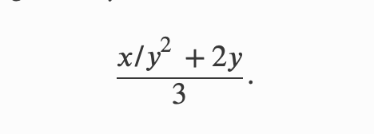

Exercise 1.8: Newton’s method for cube roots is based on the fact that if `y` is an approximation to the cube root of `x`, then a better approximation is given by the value



Use this formula to implement a cube-root procedure analogous to the square-root procedure. (In 1.3.4 we will see how to implement Newton’s method in general as an abstraction of these square-root and cube-root procedures.)

---

```scheme
(define (square x)
  (* x x))

; using the new form of improving guesses
(define (improve guess x)
  (/ (+ (/ x (square guess)) (* 2 guess)) 3))

; iterate until system precision cannot improve
(define (good-enough? guess x)
  (= (improve guess x) guess))

; similar pattern to sqrt-iter
(define (cube-iter guess target)
  (if (good-enough? guess target)
      guess
      (cube-iter (improve guess target) target)))

; 1.1 as initial guess to avoid a division by 0 error for -2
(define (cubert target)
  (cube-iter 1.1 target))

(cubert -2)
```